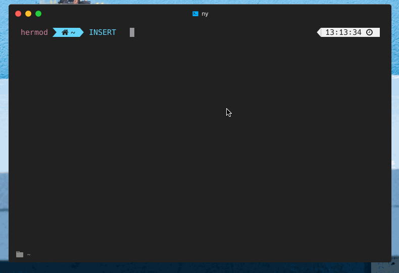

hyper-toggle-transparency
===

Toggle transparency of Hyper by ⌘-u/ctrl-u.
This plug-in aimed to mimic the toggle transparency behavior of [iTerm2](https://www.iterm2.com/).



## Configuration

`hyper-toggle-transparency` can be configured in `~/.hyper.js` configuration file within the `config` object:

```javascript
module.exports = {
  config: {
    // ... other options
    hyperToggleTransparency: {
      opacity: 0.7,  // set transparency from 0.0 to 1.0
    },
    plugins: [
      'hyper-toggle-transparency'
    ]
  }
}
```
